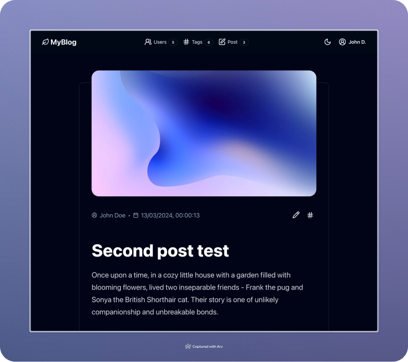
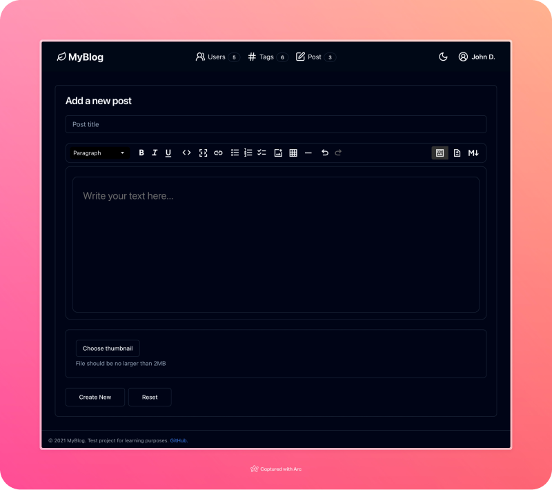

# Mongoose-express with client app (React)

A simple express server with mongoose (ODM) with typescript and a client app (Vite/React) to manage the blog posts and other data.
Demo https://blog.floatrx.net/



### MdxEditor (client)


> [!NOTE]
> Main purpose is to demonstrate the functionality of MongoDB (using Mongoose ODM) with Express server (Node.js). 
> The client-side part of the single page application was created just for demonstration. 
> The best option for a seo-optimized blog would be to use Next.js. 
> Consequently, the need for Express disappears, as Next.js is a full-stack framework.

## Pre-requisites
> ### Database: MongoDB
> Check the [mongodb](./mongo/README.md) README for more information.

> ### Client & Server
> Check the [client](./client/README.md) and [server](./server/README.md) READMEs for more information.

## Development
```shell
yarn dev
```

> [!NOTE]
> Mount the `mongo` container before running the server.


## Roadmap
- [x] MongoDB (Docker)
- [ ] Authentication (server) -> JWT, bcrypt, middleware (Oauth?) ⏳
- [x] Add file upload S3 (server) 
- [ ] Add users ⏳
- [ ] Add roles ⏳
- [ ] Add posts (auth) ⏳
  - [ ] create post
  - [ ] update post
  - [ ] delete post
  - [ ] find post by id, title, author or tag
  - [ ] find all posts
  - [ ] paginate posts
  - [ ] add default sort
- [ ] Add tags ⏳
  - [ ] find posts by tag
  - [ ] create tag
  - [ ] delete tag
  - [ ] add tag to post
  - [ ] remove tag from post

## Client
- [x] Add Redux-Toolkit
  - [x] Add endpoints
    - [x] auth
      - [x] move session from localstorage to redux -> setup persist
    - [x] user
    - [x] posts
      - [x] create post view with editor (markdown)
    - [ ] tags 
      - [ ] find posts by tag
      - [x] create tag
      - [x] delete tag
      - [x] add tag to post
      - [x] remove tag from post
- [x] Upd BaseQueryFn ⏳
- [x] Add TailwindCSS & ShadCN components
- [x] Create Router ⏳
- [x] Add Views ⏳
  - [x] login
  - [x] register
  - [x] posts 
  - [x] tags
### Total progress
`[==========.........] 50%`

## Deployment
1. Setup mongo with docker or use a cloud service
2. Setup server with pm2 and nginx (check ecosystem.config.js for more information)
3. Setup client with nginx
### Nginx (example configuration)
```nginx configuration
# API
server {
    server_name blog-api.floatrx.net;
    location / {
        proxy_pass http://127.0.0.1:3000;
        proxy_http_version 1.1;
        proxy_set_header Upgrade $http_upgrade;
        proxy_set_header Connection 'upgrade';
        proxy_set_header Host $host;
        proxy_cache_bypass $http_upgrade;
    }
    error_log /var/log/nginx/blog-api-error.log;
}
# CLIENT
server {
    server_name blog.floatrx.net;
    root /var/www/blog;
    index index.html;
    location / {
        try_files $uri $uri/ /index.html;
    }
}
```

> [!NOTE]
> Use certbot to generate SSL certificates.

Happy coding! 🚀
